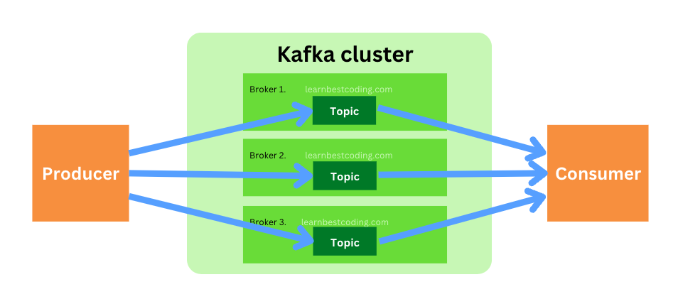
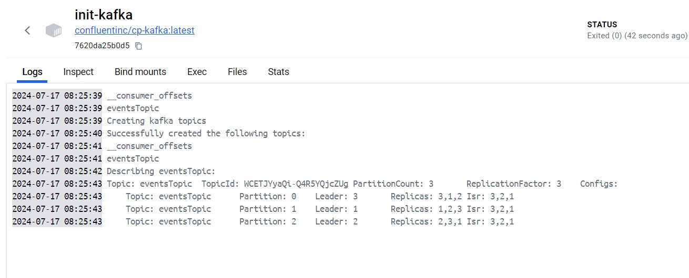

# Kafka-Cluster-Docker

*#kafka #docker #cluster*



### Run an Apache Kafka cluster with Zookeeper in Docker.

In this repository, we develop a Docker yaml file that hosts a Kafka cluster with three brokers, which are managed by Zookeeper. Also, we create a topic named "eventsTopic" that is created by the yaml file. Please follow the commands step by step:

Run the command in Linux CLI:

```
sudo nano /etc/wsl.conf
```

Add two lines in wsl.conf, save and exit.

```
[network]
generateHosts = false
```

If needed set Host names (a mini DNS server) and after that save and exit (optional):

```
sudo nano /etc/hosts
```

```
127.0.0.1       kafka1
127.0.0.1       kafka2
127.0.0.1       kafka3

source ~/.bashrc
```

Create the necessary directories in your current working directory:

```
mkdir -p zookeeper/data zookeeper/log kafka1/data kafka2/data kafka3/data
```

Finaly run Docker yaml file:

```
docker-compose up -d
```

Now, your server is running.

To connect to the server and produce, First run ***`user_event_producer.py`*** file in Linux CLI. After that in the new Linux CLI run ***`user_event_consumer.py`*** file.

Congratulations, in your local you can produce and use kafka cluster in Docker.

---

In the ***`init-kafka`*** container, you can see more informain log.



---

*Acknowledgment,*

I would like to thank my teacher, *[Dr. Mohammad Fozouni](https://www.linkedin.com/in/fozouni/)* (Faculty at GKU | Data Engineering with AWS). I will never be able to thank you enough for your daily support. I admire you.

---
